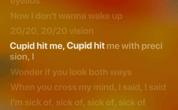

# Spicy Lyrics
Hi, I'm Spikerko (the person who made this repo). I've been really passionate about this project, even though it isn't public yet. I'm really happy for this project.

I've seen a problem with the Spotify Lyrics. They're plain, just static colors, and then I decided to install a Spicetify Lyrics Extension (I'm not gonna say the name), that was beautiful, beautiful animations, dynamic background, Syllable Synced lyrics.
"Wow, It's amazing". After some time, I wanted to build my own version. I started building it recently. After I started building it, I found out that the Lyrics Extension I previously used, was failing. Couldn't get the lyrics, buggy styles, and It feels so random, to basically
build a new extension which very similar, but also trying to focus on what the user wants. And here we are, me building a lyrics extension called **Spicy Lyrics**. Hope you like it!

